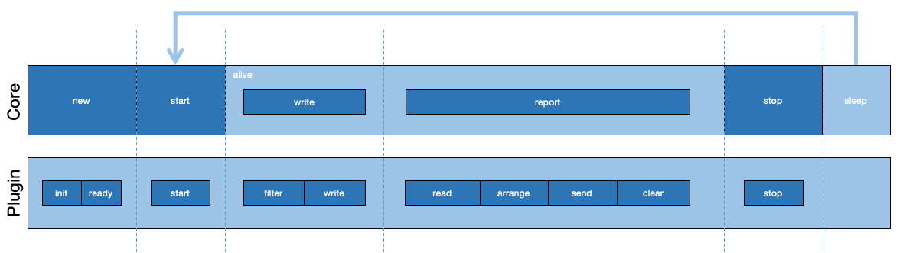

# ANYS

Most agile javascript application montior SDK.

## What's Anys?

Anys is a javascript sdk which help developers, enterprise teams and website builders to monitor their applications or websites easly. The biggest characteristic of Anys is the architecture with agile design with which we can compose different features for different demands quickly.

## Idea

1. Core-Plugin architecture, core to provide main process and lifecycle, plugins to serve features
2. Plugins' features are controllered by initialize configuration
3. Plugin can be dependented by another
4. Logs formatter
5. Separate collection and reporting, so that we can arrange, store and filter logs in local
6. Small and light

In the architecture, we have two space, and when we invoke the core SDK instance's methods, it will call plugins' hooks to finish their works.

This architecture make the monitor more agile to compact your real demands.

## Community

QQ群： 894883922 

